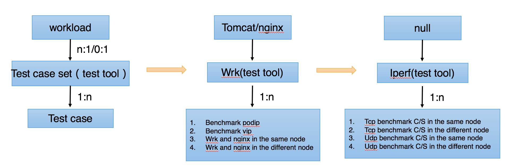
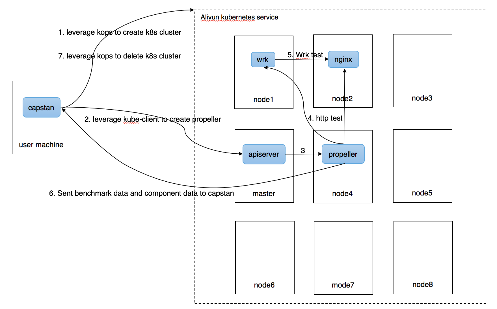

# The Design of Capstan

The project is named as Capstan(the winch of a ship) temporarily.

## Conception

The figure below shows the conceptions we use in this project.



## Testing Indicators

### The testing indicators of kubernetes cluster

1. the creating time of kubernetes cluster.

2. The load of Kubernetes API responsiveness.

3. The startup latency of pod.

### The testing indicators of kubernetes node

1. The startup latency of pod.

2. The CPU usage of node including each workload and each addons situation.

3. The memory usage of node including each workload and each addons situation.

4. Disk I/O

5. Network I/O

### The testing indicators of workload

The workload can be classified into four categories which mentioned in the two papers *[Workload Classification Model for Specializing Virtual Machine Operating System](http://ieeexplore.ieee.org/document/6676713/)* and *[Workload Classification & Software Energy Measurement for Efficient Scheduling on Private Cloud Platforms](https://arxiv.org/abs/1105.2584)*.

#### CPU-Intensive

The CPU-Intensive workload is the workload which costs most of its time to execute CPU action, such as calculations and logical judgment. Take the calculation of pi as an example. When the workload is executed, most of its time is used to calculate trigonometric functions and radical numbers. It is a CPU-Intensive workload.

We can use the following benchmark to measure it:

1. FFT (Mflops)--The number of floating-point operations per second when making Fourier transform.

#### Memory-Intensive

The Memory-Intensive workload is the workload which needs to use memory to store massive calculation data frequently, such as, the support vector machine's training and prediction process.

We can use the following indicator to measure it:

1. memory-bandwith

#### I/O-Intensive

We can use the tool *[fio](http://manpages.ubuntu.com/manpages/natty/man1/fio.1.html)* and database‘s performance indicators to describe the I/O performance of PD(Persistent Disk).

fio is a tool that will spawn a number of threads or processes doing a particular type of I/O action as specified by the user. The typical use of fio is to write a job file matching the I/O load one wants to simulate. So we can run fio to simulate logging, database and streaming. It contains four scenes: sequential write, sequential read, random write and random read, each of them contains the following indicators:

1. iops ()--The number of I/O operations per second
2. bandwidth (KB/s)--bandwidth
3. latency_min (usec)--minimum latency
4. atency_max (usec)--maximum latency
5. latency_mean (usec)--average latency
6. latency_p50 (usec)--latency of 50% operations
7. latency_p90 (usec)--latency of 90% operations
8. latency_p99 (usec)--latency of 99% operations
9. latency_p99.9 (usec)--latency of 99.9% operations

MongoDB, Redis, Cassandra and other databases have the corresponding performance testing tools. We can leverage the corresponding performance testing tools to obtain the indicators:

1. overall RunTime (ms)--the total running time
2. overall Throughput (ops/sec)--overall Throughput
3. insert MinLatency (ms)--minimum latency of insert operation
4. insert MaxLatency (ms)--maximum latency of insert operation
5. insert p50 latency (ms)--latency of 50% insert operations
6. insert p75 latency (ms)--latency of 75% insert operations
7. insert p90 latency (ms)--latency of 90% insert operations
8. insert p95 latency (ms)--latency of 95% insert operations
9. insert p99 latency (ms)--latency of 99% insert operations
10. insert p99.9 latency (ms)--latency of 99.9% insert operations
11. read MinLatency (ms)--minimum latency of read operation
12. read MaxLatency (ms)--maximum latency of read operation
13. read p50 latency (ms)--latency of 50% read operations
14. read p75 latency (ms)--latency of 75% read operations
15. read p90 latency (ms)--latency of 90% read operations
16. read p95 latency (ms)--latency of 95% read operations
17. read p99 latency (ms)--latency of 99% read operations
18. read p99.9 latency (ms)--latency of 99.9% read operations
19. update MinLatency (ms)--minimum latency of update operation
20. update MaxLatency (ms)--maximum latency of update operation
21. update p50 latency (ms)--latency of 50% update operations
22. update p75 latency (ms)--latency of 75% update operations
23. update p90 latency (ms)--latency of 90% update operations
24. update p95 latency (ms)--latency of 95% update operations
25. update p99 latency (ms)--latency of 99% update operations
26. update p99.9 latency (ms)--latency of 99.9% update operations

#### Network-Intensive

We can use iperf, netperf, ping and other tools to test the network performance.

The main indicators are as follows :

1. TCP_Throughput (Mbits/sec)--TCP Throughput
2. TCP_RR_Average_Latency (ms)--the average transaction latency from client to server in a TCP connection
3. TCP_STREAM_Total_Throughput (Mbits/sec)--throughput in TCP streaming
4. Latency--Round-trip delay time

Additionally we can test the performance of http server(Nginx, Tomcat, etc.) by wrk, ab and other tools.

The main indicators of http server are as follows :

1. bytes transferred (bytes)--the total bytes transferred
2. requests ()--the number of requests
3. throughput (requests/sec)--the requested throughput
4. Average response time (ms)--average response time
5. p50 latency (ms)--latency of 50% requests
6. p75 latency (ms)--latency of 75% requests
7. p90 latency (ms)--latency of 90% requests
8. p95 latency (ms)--latency of 95% requests
9. p99 latency (ms)--latency of 99% requests
10. p99.9 latency (ms)--latency of 99.9% requests

### The testing indicators of Kubernetes Cluster Component

The main components include the following two categories:

1. Kubelet

Kubelet is started in binary form. We can use the commands such as top, pmap, or read the `proc` file to acquire the kubelet CPU and memory usage.

2. Apiserver, kube-controller-manager, kube-proxy and the system containers provided by the cloud offerings, such as ingress-controller, fluentd-log and api-gateway.

The above components are run as containers. So we can directly use cadvisor to get their CPU and memory usage.

The main indicators are as follows :

1. CPU maximum usage
2. CPU minimum usage
3. CPU average usage
4. The CPU usage of 50% time
5. The CPU usage of 70% time
6. The CPU usage of 90% time
7. Maximum memory usage
8. Minimum memory usage
9. Average memory usage
10. The memory usage of 50% time
11. The memory usage of 70% time
12. The memory usage of 90% time

## Architecture

This project mainly includes two components: Capstan and Propeller.



### Capstan

Main functions:

1. Cluster life cycle management. We leverage kops（or some other project） to create a specified configuration kubernetes cluster in aliyun,gcp,aws or other cloud offerings and delete the created kubernetes cluster when all testings are completed. It also supports already existing cluster which are not managed by the Capstan by specifying the parameter `"CloudProvider":"local"`.

2. Start the Propeller service. Capstan generates the configuration of Propeller and start it.

3. Data collection. The testing data of workloads generated by the Propeller, the performance data of the kubernetes components, and the kubernetes cluster performance date are collected and sent to Capstan for persistent storage.

4. Data Display. Analyze the collected data and display.

### Propeller

Main functions:

1. Workload testing. Traverse the workloads which need to be testing. Prepare testing environment to start one testing case and clenup the testing environment after the testing case finished to prepare for the next testing case according to each workload‘s test case set.

2. Data collection. Collect testing results and performance metrics of each kubernetes cluster component when running each testing case.

### Process

1. The Capstan leverages kops to create the specified configuration kubernetes cluster in the cloud offerings such as aliyun, gcp, aws.

2. The Capstan creates the Propeller service through kubernetes API.

3. The Propeller starts each testing case of each workload according to the configuration generated by Capstan.

4. The Propeller collects testing data and performance data of kubernetes components.

5. The Propeller sends the collected data to Capstan for presistent storage according to the parameter `"CapstanEndpoint": "user_machine_ip:8081"`.

6. The Capstan analyzes the collected data and display.

### Capstan Profile

```json
{
    "Description": "capstan",
    "Clusters": {
        "CloudProvider": "Aliyun",// Create cluster in aliyun, this          parameter supports Aliyun, gcp, aws, local and so on
        "K8sVersion": "1.9", // k8s cluster version
        "NodeNums": "10",    // Number of k8s cluster nodes
        "OS": "ubuntu16.04", // K8s cluster operating system
        "VCPU": "4",         // Number of vcpu cores of each node
        "Memeroy": "8G"      // Memory size of each node
    },
    "Propeller": { // Propeller configuration section
        "Description": "propeller",
        "ResultsDir": "/tmp/propeller", // Storage address of testing data
        "CapstanEndpoint": "user_machine_ip:8081", // Endpoint of capstan
        "Steps": 10, // Interval time between each workload
        "Sampling": 5, // Sampling Interval time of k8s components
        "Workload": [
            {
                "name": "http-test", // The name of workload
                "type": "wrk",       // The used test tool
                "image": "nginx:17.9", // image of workload
                "Steps": 5, // Interval time between each testing case
                "testCaseSet": { // Testing case set
                    "benchmarkPodIPSameNode": true,
                    "benchmarkVIPSameNode": true,
                    "benchmarkPodIPDiffNode": true,
                    "benchmarkVIPDiffNode": true
                }
            },
            {
                "name": "network-test1",
                "type": "iperf",
                "Steps": 5,
                "testCaseSet": {
                    "benchmarkTCPSameNode": true,
                    "benchmarkUDPSameNode": true,
                    "benchmarkTCPDiffNode": true,
                    "benchmarkUDPDiffNode": true
                }
            }
        ]
    },
    "ResultsDir": "/etc/capstan", // Storage address of Capstan
    "Server": {  // http server for data display
        "advertiseaddress": "user_machine_ip:8080",
        "bindaddress": "0.0.0.0",
        "bindport": 8080,
        "timeoutseconds": 5400
    },
    "Version": "v0.1" // Version Information
}
```

### Propeller profile

```json
{
    "Description": "propeller",
    "ResultsDir": "/tmp/propeller",
    "CapstanEndpoint": "user_machine_ip:8081",
    "Steps": 10,
    "Sampling": 5,
    "Workload": [
        {
            "name": "http-test",
            "type": "wrk",
            "image": "nginx:17.9",
            "Steps": 5,
            "testCaseSet": {
                "benchmarkPodIPSameNode": true,
                "benchmarkVIPSameNode": true,
                "benchmarkPodIPDiffNode": true,
                "benchmarkVIPDiffNode": true
            }
        },
        {
            "name": "network-test1",
            "type": "iperf",
            "Steps": 5,
            "testCaseSet": {
                "benchmarkTCPSameNode": true,
                "benchmarkUDPSameNode": true,
                "benchmarkTCPDiffNode": true,
                "benchmarkUDPDiffNode": true
            }
        }
    ]
}
```

### Propeller service yaml file

```yaml
apiVersion: v1 //Create a new one namespace
kind: Namespace
metadata:
  name: propeller
---
apiVersion: v1
kind: ServiceAccount
metadata:
  labels:
    component: propeller
  name: propeller-serviceaccount
  namespace: propeller
---
apiVersion: rbac.authorization.k8s.io/v1beta1
kind: ClusterRoleBinding
metadata:
  labels:
    component: propeller
  name: propeller-serviceaccount
roleRef:
  apiGroup: rbac.authorization.k8s.io
  kind: ClusterRole
  name: propeller-serviceaccount
subjects:
- kind: ServiceAccount
  name: propeller-serviceaccount
  namespace: propeller
---
apiVersion: rbac.authorization.k8s.io/v1beta1
kind: ClusterRole
metadata:
  labels:
    component: propeller
  name: propeller-serviceaccount
  namespace: propeller
rules:
- apiGroups:
  - '*'
  resources:
  - '*'
  verbs:
  - '*'
---
apiVersion: v1
data:
  config.json: |
    {
        "Description": "propeller",
        "ResultsDir": "/tmp/propeller",
        "Steps": 10,
        "Sampling": 5,
        "CapstanEndpoint": "user_machine_ip:8081",
        "Workload": [
          {
            "name": "http-test",
            "type": "wrk",
            "image": "nginx:17.9",
            "Steps": 5,
            "testCaseSet": {
              "benchmarkPodIPSameNode": true,
              "benchmarkVIPSameNode": true,
              "benchmarkPodIPDiffNode": true,
              "benchmarkVIPDiffNode": true
            }
          },
          {
            "name": "network-test1",
            "type": "iperf",
            "Steps": 5,
            "testCaseSet": {
              "benchmarkTCPSameNode": true,
              "benchmarkUDPSameNode": true,
              "benchmarkTCPDiffNode": true,
              "benchmarkUDPDiffNode": true
            }
          }
        ]
    }
kind: ConfigMap
metadata:
  labels:
    component: propeller
  name: propeller-config-cm
  namespace: propeller
---
apiVersion: v1
kind: Pod
metadata:
  labels:
    component: propeller
  name: propeller
  namespace: propeller
spec:
  containers:
  - command:
    - /bin/bash
    - -c
    - /propeller --no-exit=true -v 3 --logtostderr
    env:
    - name: PROPELLER_ADVERTISE_IP
      valueFrom:
        fieldRef:
          fieldPath: status.podIP
    image: wadelee/propeller:v0.1
    imagePullPolicy: IfNotPresent
    name: propeller
    volumeMounts:
    - mountPath: /etc/propeller
      name: propeller-config-volume
    - mountPath: /tmp/propeller
      name: output-volume
  restartPolicy: Never
  serviceAccountName: propeller-serviceaccount
  volumes:
  - configMap:
      name: propeller-config-cm
    name: propeller-config-volume
  - emptyDir: {}
    name: output-volume
---
apiVersion: v1
kind: Service
metadata:
  labels:
    component: propeller
  name: propeller
  namespace: propeller
spec:
  ports:
  - port: 8080
    protocol: TCP
    targetPort: 8080
  selector:
    component: propeller
  type: ClusterIP
---
```

## Project Directory Structure

```go
├── Makefile
├── README.md
├── cmd
│   ├── capstan
│   │   └── capstan.go // Entry of capstan
│   └── propeller
│       └── propeller.go // Entry of propeller
├── docs   // Document directory
│   ├── README.md
│   ├── configuration.md // Configuration document
│   ├── design.md        // Design document
│   ├── developer.md     // Developer document
│   └── images
│       ├── capstan.png
│       └── concept.png
├── examples
│   ├── capstan_conf.json   // Capstan configuration example
│   ├── propeller.yaml      // Propeller service example
│   └── propeller_conf.json // Propeller configuration example
├── main.go
├── pkg
│   ├── analysis          // Data Analysis Package
│   │   ├── analysis.go   // Analysis interface file
│   │   ├── iperf.go      // Iperf tool implements the analysis interface
│   │   ├── tensorflow.go // Tensorflow implements the analysis interface
│   │   └── wrk.go        // Wrk tool implements the analysis interface
│   ├── build // Build package of testing tools
│   │   ├── iperf
│   │   │   ├── Dockerfile
│   │   │   ├── Makefile
│   │   │   └── run_iperf.sh
│   │   ├── tensorflow
│   │   └── wrk
│   ├── config         // Resolve configuration
│   │   └── config.go
│   ├── dashboard      // Display the collected data
│   │   └── dashboard.go
│   ├── data           // Collect data
│   │   ├── cadvisor // Collect container performance data through cadvisor
│   │   │   └── cadvisor.go
│   │   ├── kubelet  // Collect kubelet‘s performance data
│   │   │   └── kubelet.go
│   │   └── testtoollog // Collect testing results data
│   │       └── testtoollog.go
│   ├── driver // Propeller driver for starting workload
│   │   ├── deamonset.go  // deamonset driver
│   │   ├── deployment.go // deployment driver
│   │   └── job.go        // job driver
│   ├── lifecycle // Cluster lifecycle management of cloud offerings
│   │   ├── aliyun.go
│   │   ├── aws.go
│   │   ├── gcp.go
│   │   └── lifecycle.go // Interface of cluster lifecycle management
│   ├── testtools // Testing tools Package
│   │   ├── testtools.go // Testing tool interface
│   │   ├── iperf
│   │   │   └── iperf.go // Iperf tool implements the testtools interface
│   │   ├── tensorflow
│   │   │   └── tensorflow.go // Tensorflow implements the testtools interface
│   │   └── wrk
│   │       └── wrk.go  // Wrk tool implements the testtools interface
│   ├── utils
│   │   └── k8s_util
│   │       └── k8s_util.go
│   └── workload // Workload Package
│       ├── nginx.go // Nginx implements the workload interface
│       ├── tensorflow.go // Tensorflow implements the workload interface
│       └── workload.go // Workload interface
└── hack   // Tools
```

## Developer(How to add a new workload)

### A new workload has a corresponding test tool

1. You only have to implement the workload interface which in the `pkg/ workload` package.

### A new workload which does not have a corresponding test tool

1. First, you need to implement the testtool and analysis interface which are in `pkg/testtool` package and `pkg/analysis` package.

2. Secondly, you need to implement the workload interface which in the `pkg/ workload` package.

## User

We can evaluate the kubernetes cluster ability by comparing the results generated by Capstan horizo​​ntally and vertically:

1. Get the performance indicators data of each workload and each component in the specific configuration of kubernetes cluster offered by specific cloud offerings.

2. Get the performance loss data of kubernetes cluster when add a new addons.

3. Get the performance comparison data of different cloud offerings which have same configuration and get the pros and cons under different indicators by analysising the performance comparison data.

### How to use the results to evaluate the kubernetes cluster ability

1. Run Capstan repeatedly and Capstan will yield a result by normalizing these data, and the result represents the performance of this kubernetes cluster.

2. We will design a online ranking system in which you can register you capstan result, you will get a score and you can find the difference with other kubernetes cluster offered by different cloud offering with different configuration.

## Roadmap

- Basic cluster lifecycle management including creating, destroying and other operations(optional).
- Design the testing indicators（phase 1）.
- Design the framework of Capstan（phase 1）.
- Implement multiple workload（phase 1）.
- Implement the online ranking system（phase 2）.